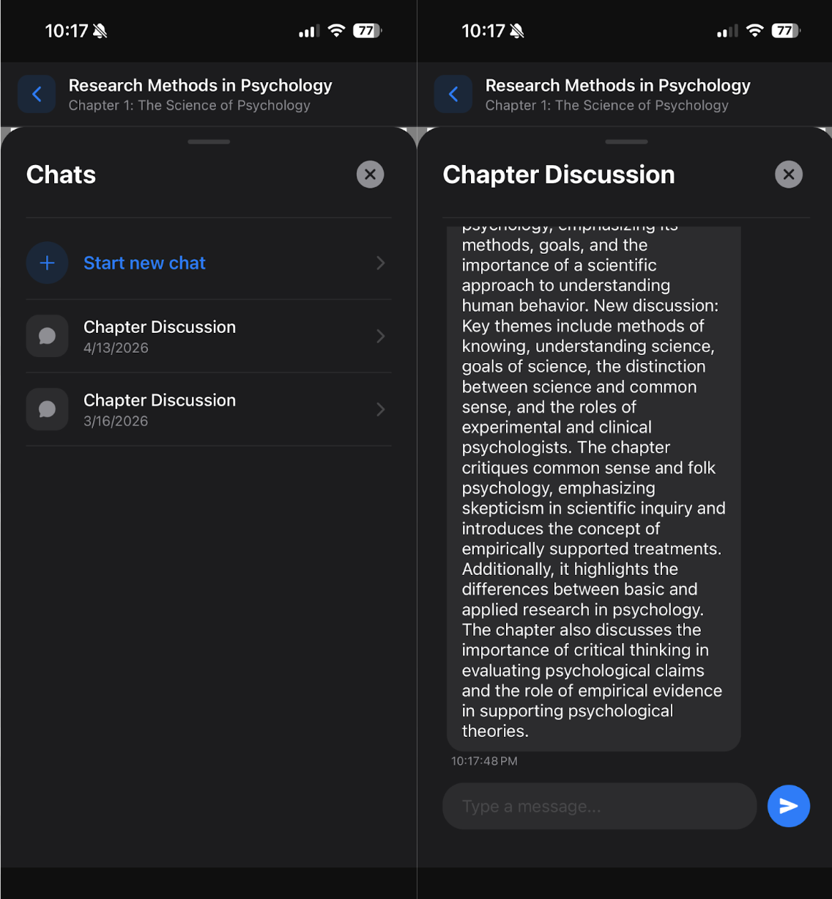
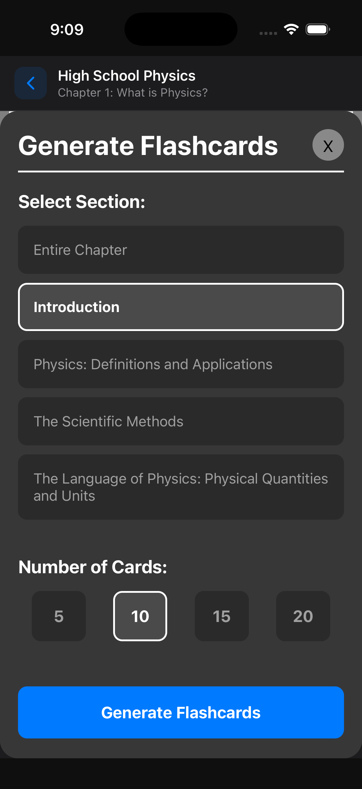
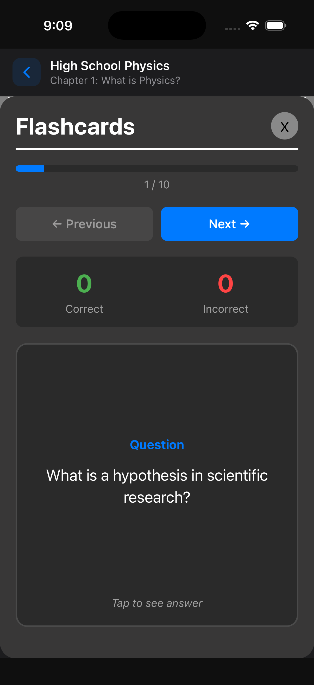
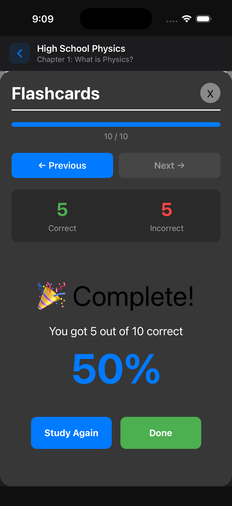
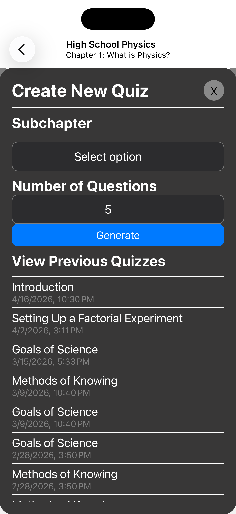
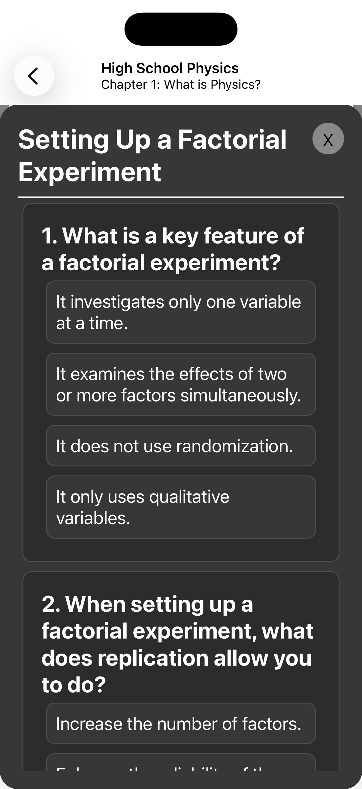
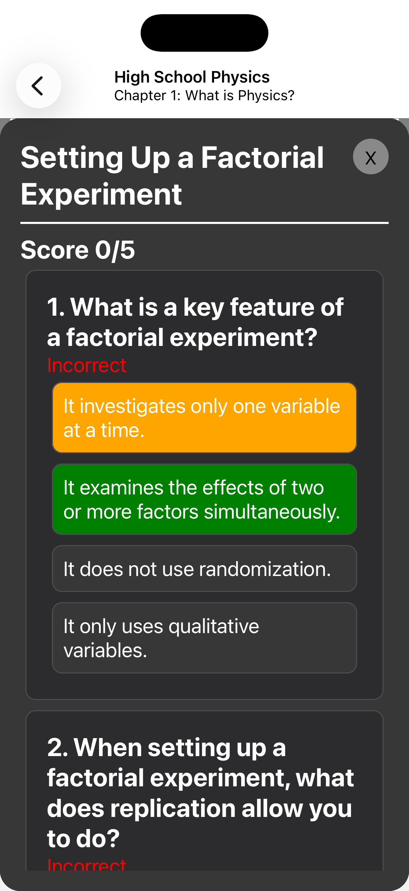

# AI-Textbook-Capstone
Cross platform mobile app that uses AI to process open source textbooks and aid students in learning by providing flashcards, generating questions, and discussing content.

## The Problem
Having access to peers or a mentor can make learning a new subject significantly easier. However, scheduling time to study with friends can be difficult and teachers often don't have time to give each student the attention they need to succeed. Our app can help compensate for this by giving students access to an AI tutor on the go. The app allows students to view open source textbooks and ask the tutor questions about the text as they read. In addition, the tutor can generate study aids such as flash cards and quizzes.

## Features

### AI Chat


The user can ask the AI tutor questions about the textbook. The AI will know which chapter and section the user is reading and will tailor its reponse based on that.

### AI Flashcards



To help the user study, they can ask the AI to create flashcards for the section of the textbook they are currently reading. These flashcards are saved and can be viewed later.

### AI Quizzes



The AI can also generate short, multiple choice quizzes for the user. These quizzes are automatically graded and can be taken as many times as the user needs in order to get the content down.

## Setup

### Prerequisites 
* An emulator or a mobile device that can run the app. See this guide for setting up environment https://docs.expo.dev/get-started/set-up-your-environment/?platform=ios&device=simulated 
    * If you want to run the app on a mobile device, you will need to download the Expo Go app.
* Nodejs v24 isntalled
* Git installed

### Run the front end locally
* Clone the repo using ```git clone https://github.com/lethangomes/AI-Textbook-Capstone.git```
* cd into AI-Textnook-Capstone/AI-Textbook-App
* run ```npm install```
* run ```npx expo install prettier eslint-config-prettier eslint-plugin-prettier --dev``` on mac or ```npx expo install prettier eslint-config-prettier eslint-plugin-prettier "--" --dev``` on windows to install prettier
* run one of the following commands to start the app
    * ```npm run start``` - Brings up QR code for running app on mobile and a menu to switch to android/iOS emulation
    * ```npm run ios``` - requires iOS emulator
    * ```npm run android``` - requires android emulator
* If you're running an emulator, the app should automatically open in the emulator. If you're using a mobile device, use the first option and scan the QR code.

### Run the backend locally
The backend was built by a previous capstone team and this project reuses it. To run it locally, please refer to their documentation at this repository: https://github.com/2025-26-capstone-AI-mobile-app/OER_tutor

### Team members
Lucas Gomes - gomesl@oregonstate.edu

Jimena - noaguevg@oregonstate.edu

Adithya - nairadi@oregonstate.edu

### Feedback
If you have any feedback, feel free to email one of us using the emails above or add a github issue!

# License
Pending Partner confirmation
